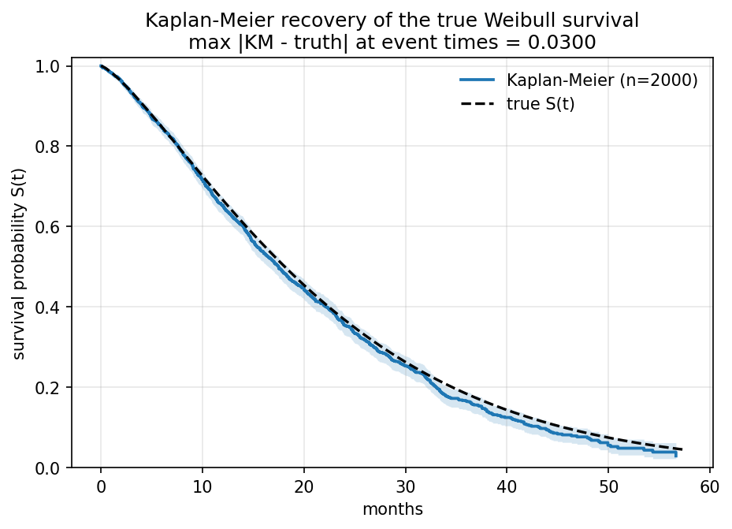
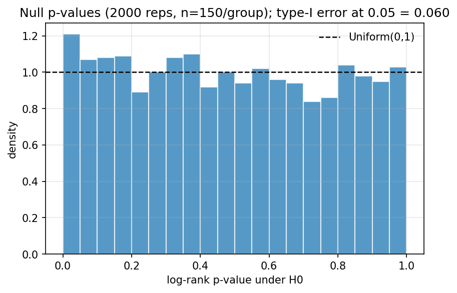
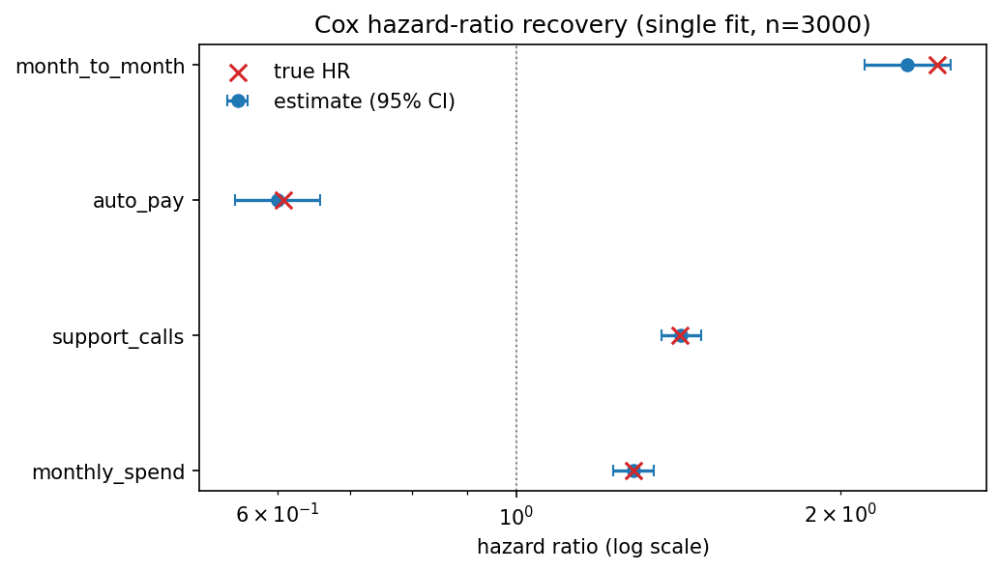
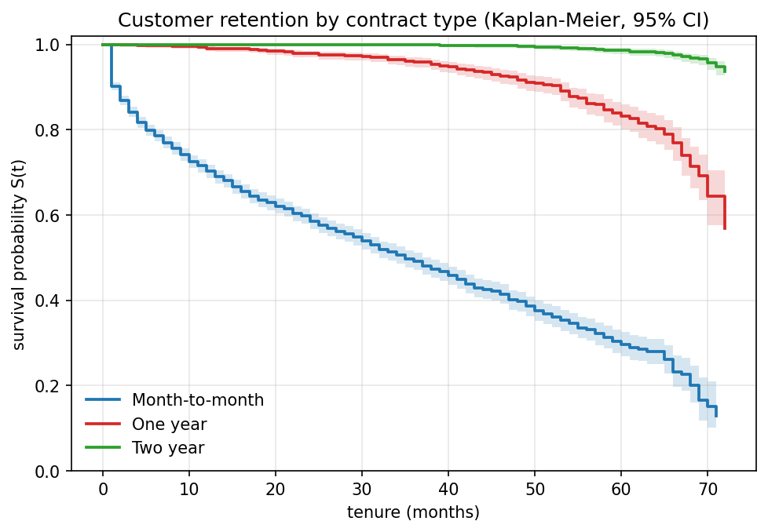
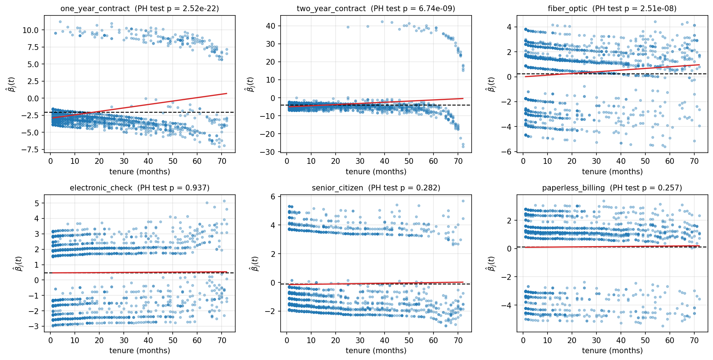
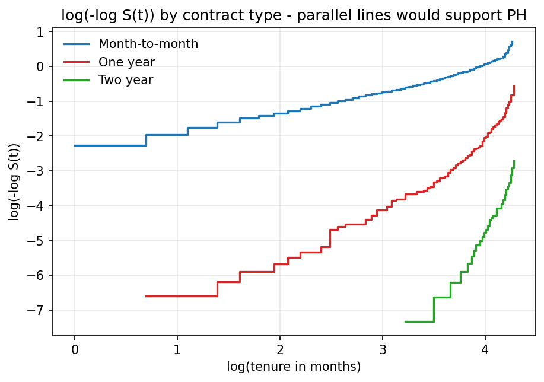

# survival-analysis-churn

Survival analysis for customer churn, implemented from scratch in NumPy/SciPy, no `lifelines`, no `scikit-survival`. The point is the statistical machinery: the Kaplan-Meier estimator with Greenwood variance, the k-sample log-rank test, Cox proportional hazards fitted by Newton-Raphson on the Efron partial likelihood, and proportional-hazards diagnostics via scaled Schoenfeld residuals. Everything is validated two ways: against simulations with known ground truth, and on the IBM Telco Customer Churn dataset. All numbers below are produced by the committed code and live in `results/`.

## Why survival analysis (and why ordinary regression fails)

A churn dataset observed at a snapshot date contains two kinds of customers: those who already churned (we know their lifetime) and those still subscribed (we only know their lifetime *exceeds* their current tenure, they are **right-censored**). In the Telco data below, 73% of customers are censored. Ordinary tools break on this:

- **Regressing lifetime on covariates after dropping censored customers** keeps only the short lifetimes, every long-lived loyal customer is thrown away, biasing predicted lifetimes sharply downward. The customers you most want to understand are precisely the ones you delete.
- **Treating observed tenure as the outcome for everyone** pretends a 40-month-and-counting subscriber lived exactly 40 months, again biasing lifetimes downward, and more severely for recently acquired cohorts, which distorts covariate effects.
- **Logistic regression on "churned within the window"** discards timing entirely, and its answer depends on the arbitrary window: a customer acquired last quarter hasn't had *time* to churn yet, which the model misreads as loyalty.

Survival analysis is built for exactly this data structure. Each subject contributes a pair $(T_i, \delta_i)$: a follow-up time and an indicator of whether the event was observed ($\delta_i = 1$) or censoring intervened ($\delta_i = 0$). Censored subjects still contribute information, they are known to have survived *at least* $T_i$, through their presence in risk sets. The key identifying assumption is that censoring is independent of the event process given covariates (plausible here: censoring is just the administrative snapshot date).

## The mathematics implemented

### Survival and hazard functions

$$S(t) = P(T > t), \qquad h(t) = \lim_{\Delta \to 0} \frac{P(t \le T < t + \Delta \mid T \ge t)}{\Delta}, \qquad S(t) = \exp\Big({-\int_0^t h(u)\,du}\Big).$$

### Kaplan-Meier estimator (`src/survival/km.py`)

With distinct event times $t_1 < t_2 < \cdots$, $d_i$ events at $t_i$, and $n_i$ subjects at risk just before $t_i$,

$$\hat S(t) = \prod_{i:\,t_i \le t}\Big(1 - \frac{d_i}{n_i}\Big).$$

This is the nonparametric MLE of $S$ under right censoring: writing the likelihood in terms of discrete hazards $\lambda_i$ at the observed event times, each factor is $\lambda_i^{d_i}(1-\lambda_i)^{n_i - d_i}$, maximized at $\hat\lambda_i = d_i / n_i$. The delta method applied to $\log \hat S$ gives **Greenwood's variance**,

$$\widehat{\mathrm{Var}}[\hat S(t)] = \hat S(t)^2 \sum_{i:\,t_i \le t} \frac{d_i}{n_i (n_i - d_i)},$$

and confidence intervals are formed on the complementary log-log scale $\theta = \log(-\log S)$, where the parameter is unbounded, then back-transformed as $\hat S^{\exp(\pm z_{\alpha/2}\,\widehat{\mathrm{se}}(\hat\theta))}$, which keeps the limits inside $[0,1]$ by construction and is markedly better behaved near the boundaries than the naive linear interval.

### Log-rank test (`src/survival/logrank.py`)

At each pooled event time, condition on the margins of the groups × (event, no event) table. Under $H_0$ (one shared survival curve), the event count in group $g$ is hypergeometric with mean $d_j n_{gj}/n_j$ and covariance $\frac{d_j(n_j-d_j)}{n_j-1}\,\frac{n_{gj}}{n_j}\big(\delta_{gh} - \frac{n_{hj}}{n_j}\big)$. Summing over event times and dropping one redundant group,

$$X^2 = \mathbf{z}^\top V^{-1} \mathbf{z} \sim \chi^2_{k-1}, \qquad \mathbf{z} = (O-E)_{1..k-1},$$

which for two groups reduces to the familiar $(O_1 - E_1)^2 / V_{11}$. Any number of groups is supported.

### Cox proportional hazards (`src/survival/cox.py`)

The model $h(t \mid x) = h_0(t)\, e^{x^\top \beta}$ leaves the baseline hazard unspecified. Cox's insight: conditional on an event occurring at time $t_j$ with risk set $R_j$, the probability it was subject $i$ is $e^{x_i^\top\beta} / \sum_{l \in R_j} e^{x_l^\top\beta}$, the baseline cancels. The product of these factors is the **partial likelihood**; its maximizer is consistent and asymptotically normal without ever modeling $h_0$.

Tenure is recorded in whole months, so tied event times are heavy and tie handling matters. This implementation uses **Efron's approximation** (default; Breslow available), which treats the $d_j$ tied events as occurring in an unknown order and averages the risk-set depletion:

$$\ell(\beta) = \sum_j \Bigg[ \sum_{i \in D_j} x_i^\top \beta - \sum_{l=0}^{d_j - 1} \log\Big( \underbrace{\textstyle\sum_{i \in R_j} e^{x_i^\top \beta}}_{S_0(R_j)} - \tfrac{l}{d_j} \underbrace{\textstyle\sum_{i \in D_j} e^{x_i^\top \beta}}_{s_0(D_j)} \Big) \Bigg].$$

The gradient and Hessian are derived analytically from the risk-set sums $S_0, S_1, S_2$ (sums of $w_i$, $w_i x_i$, $w_i x_i x_i^\top$): each Efron step $l$ contributes mean $m_1^{(l)}$ and curvature $m_2^{(l)} - m_1^{(l)} m_1^{(l)\top}$ built from the $l$-adjusted sums. **Newton-Raphson** with step-halving maximizes $\ell$; convergence uses the relative log-likelihood criterion standard in Cox software. Standard errors come from the inverse observed information $\mathcal{I}(\hat\beta)^{-1}$, giving hazard ratios $e^{\hat\beta_j}$, Wald $z$-tests, and CIs $e^{\hat\beta_j \pm z_{\alpha/2}\widehat{\mathrm{se}}_j}$; a global likelihood-ratio test is also reported. Optional **stratification** gives each stratum its own baseline hazard while sharing $\beta$ (the log partial likelihoods add). Two computational paths produce identical results (unit-tested): a vectorized reverse-cumulative-sum path when all times in a stratum are distinct, and an incremental tie-set loop otherwise.

### PH diagnostics (`src/survival/diagnostics.py`)

The **Schoenfeld residual** for the subject failing at $t_k$ is $r_k = x_k - \bar x(\hat\beta, t_k)$, the covariate minus the risk-set-weighted mean (Efron-adjusted within tie sets). Under PH these have mean zero at every event time; Grambsch & Therneau (1994) showed that scaled residuals $r^*_k = m\,\hat V r_k$ estimate the time-varying deviation $\beta_j(t_k) - \hat\beta_j$. The slope test regresses them on a time transform $g(t)$ (rank by default; identity and log available):

$$\chi^2_j = \frac{m\,\big[\sum_k (g_k - \bar g)\,(r_k^\top \hat V)_j\big]^2}{\hat V_{jj} \sum_k (g_k - \bar g)^2} \sim \chi^2_1 \text{ under PH},$$

plus a global $p$-df version. The second check is graphical: under PH between groups, $\log(-\log S_g(t))$ curves are parallel (vertical shifts by $\log \mathrm{HR}$); crossing or converging curves flag violations.

## Repository layout

```
survival-analysis-churn/
├── src/survival/
│   ├── km.py               Kaplan-Meier + Greenwood + log-log CIs
│   ├── logrank.py          k-sample log-rank test
│   ├── cox.py              Cox PH: Efron/Breslow, Newton-Raphson, strata
│   ├── diagnostics.py      Schoenfeld residuals, PH slope test, log(-log S)
│   ├── simulate.py         Weibull PH cohorts with known hazard ratios
│   ├── plotting.py         shared figures
│   ├── __main__.py         CLI entry point
│   └── experiments/        run_simulation.py, run_telco.py, output helpers
├── tests/                  45 pytest tests (see below)
├── data/telco_churn.csv    IBM Telco churn data (7,043 rows)
└── results/                every figure/table below, regenerated by the CLI
```

## Install and reproduce

```bash
python -m venv .venv && source .venv/bin/activate
pip install -r requirements.txt          # numpy, scipy, pandas, matplotlib
pip install -e .                         # or: export PYTHONPATH=src

python -m survival run-simulation        # Layer 1 -> results/simulation/
python -m survival run-telco             # Layer 2 -> results/telco/

pip install pytest && pytest             # 45 tests
```

Both runners are seeded (`--seed`, default 2026) and complete in seconds; `--fast` cuts replication counts ~10× for smoke runs.

## Layer 1, validation against simulated truth

`simulate.py` draws event times from a Weibull proportional-hazards model (shape 1.3, scale 24 months) by inverse-transform sampling, with independent Uniform(0, 60) censoring, about 31-36% censored across the studies, matching a realistic churn regime. Four covariates carry known effects: `month_to_month` (β = +0.90), `auto_pay` (β = −0.50), `support_calls` (β = +0.35), `monthly_spend` (β = +0.25).

### Kaplan-Meier recovers the true curve

One cohort of n = 2,000 (35.6% censored): the KM step function tracks the true Weibull survival with **max |Ŝ − S| = 0.0300** across all 1,289 event times.



### Greenwood intervals achieve nominal coverage

500 replicates of n = 300; empirical coverage of the pointwise 95% log-log interval at four fixed times (Monte-Carlo 95% band for a true 0.95 rate: ±0.019):

| evaluation time | true S(t) | empirical coverage |
| --- | --- | --- |
| 4.25 | 0.90 | 0.968 |
| 9.20 | 0.75 | 0.952 |
| 18.10 | 0.50 | 0.952 |
| 27.68 | 0.30 | 0.950 |

### Log-rank test: correct size, sensible power

Under $H_0$ (identical hazards, 2,000 replicates) the rejection rate at the 0.05 level is **0.0605** with n = 150/group and **0.0500** with n = 400/group, the mild small-sample liberality of the asymptotic $\chi^2$ reference visibly vanishing as n grows, with the null p-value histogram close to Uniform(0,1). Power at n = 150/group (1,000 replicates each): **0.476** against HR = 1.3 and **0.927** against HR = 1.6.



### Cox recovers the true hazard ratios

Single fit, n = 3,000 (31.9% censored), every 95% CI contains the truth:

| covariate | true HR | estimated HR | 95% CI | p |
| --- | --- | --- | --- | --- |
| month_to_month | 2.460 | 2.310 | [2.107, 2.534] | 9.7e-71 |
| auto_pay | 0.607 | 0.600 | [0.548, 0.657] | 4.9e-28 |
| support_calls | 1.419 | 1.423 | [1.364, 1.484] | 1.8e-60 |
| monthly_spend | 1.284 | 1.284 | [1.229, 1.341] | 4.7e-29 |

Repeated fitting (300 replicates, n = 600) confirms the estimator and its uncertainty quantification are calibrated: bias ≤ 0.012 on every coefficient, model-based SEs matching the empirical SD, and 95% CI coverage of 0.937-0.953.

| covariate | true β | mean estimate | bias | empirical SD | mean model SE | CI coverage |
| --- | --- | --- | --- | --- | --- | --- |
| month_to_month | 0.90 | 0.9099 | +0.0099 | 0.1012 | 0.1065 | 0.953 |
| auto_pay | −0.50 | −0.5121 | −0.0121 | 0.1062 | 0.1049 | 0.950 |
| support_calls | 0.35 | 0.3505 | +0.0005 | 0.0505 | 0.0500 | 0.937 |
| monthly_spend | 0.25 | 0.2558 | +0.0058 | 0.0506 | 0.0509 | 0.940 |



## Layer 2, IBM Telco Customer Churn

**Data.** `data/telco_churn.csv` is the public IBM sample dataset (7,043 customers), included from IBM's `telco-customer-churn-on-icp4d` repository. Setup: `tenure` (months) is the follow-up time, `Churn == "Yes"` the event; still-subscribed customers are right-censored at the snapshot. Eleven customers with `tenure == 0` (joined within the snapshot month, none churned, no exposure) are dropped, leaving **n = 7,032 with 1,869 churn events (73.4% censored)**; median follow-up by reverse KM is 44 months.

### Retention by contract type



| contract | n | events | S(12 mo) | S(24 mo) | S(48 mo) | median survival |
| --- | --- | --- | --- | --- | --- | --- |
| Month-to-month | 3,875 | 1,655 | 0.703 [0.687, 0.718] | 0.586 | 0.397 | 35 months |
| One year | 1,472 | 166 | 0.991 [0.984, 0.995] | 0.978 | 0.917 | not reached |
| Two year | 1,685 | 48 | 1.000 (no churn yet) | 1.000 | 0.996 | not reached |

Half of month-to-month customers are gone by month 35; the annual-contract curves never approach 50% churn within the 72-month window, so their median survival is not reached, itself a consequence of censoring that a mean-of-observed-tenure analysis would completely garble.

The log-rank test confirms the separation is not sampling noise: overall $\chi^2 = 2{,}353$ on 2 df ($p < 10^{-300}$, below double-precision underflow), and every pairwise contrast is decisive (weakest: one-year vs two-year, $\chi^2 = 256.2$, $p = 1.1\times10^{-57}$).

### Cox model (six covariates, Efron ties)

| covariate | HR | 95% CI | z | p |
| --- | --- | --- | --- | --- |
| one_year_contract | 0.131 | [0.111, 0.155] | −23.9 | 1.2e-126 |
| two_year_contract | 0.020 | [0.014, 0.027] | −24.7 | 4.6e-135 |
| fiber_optic | 1.266 | [1.138, 1.409] | 4.3 | 1.5e-05 |
| electronic_check | 1.618 | [1.470, 1.781] | 9.8 | 9.7e-23 |
| senior_citizen | 0.897 | [0.805, 0.999] | −2.0 | 0.048 |
| paperless_billing | 1.124 | [1.007, 1.254] | 2.1 | 0.036 |

Business reading: holding the other covariates fixed, a one-year contract cuts the churn hazard by ~87% and a two-year contract by ~98% relative to month-to-month; paying by electronic check carries a 62% higher churn hazard (the strongest actionable flag, migrating these customers to automatic payment is the natural experiment to run); fiber-optic internet carries a 27% higher *average* hazard (see the diagnostics, this understates the late-tenure risk). A caution about `senior_citizen`: seniors churn far more in the raw data (41.7% vs 23.7%), yet the adjusted HR is slightly *below* 1, their excess churn is carried by their covariate mix (month-to-month contracts, electronic check, fiber), a textbook confounding reversal that the unadjusted comparison hides.

### PH diagnostics, and how the violations were handled

The Grambsch-Therneau test on scaled Schoenfeld residuals (rank transform) flags three covariates; the other three are comfortably compatible with PH:

| covariate | χ² (1 df) | p | verdict |
| --- | --- | --- | --- |
| one_year_contract | 94.45 | 2.5e-22 | **violates PH** |
| two_year_contract | 33.61 | 6.7e-09 | **violates PH** |
| fiber_optic | 31.06 | 2.5e-08 | **violates PH** |
| electronic_check | 0.006 | 0.937 | consistent with PH |
| senior_citizen | 1.157 | 0.282 | consistent with PH |
| paperless_billing | 1.283 | 0.257 | consistent with PH |
| GLOBAL (6 df) | 138.8 | 1.8e-27 | - |



The log(−log S) curves tell the same story graphically, the contract curves converge with tenure rather than staying parallel:



The violations make substantive sense. Contract customers can effectively only leave at renewal, so their hazard *relative to month-to-month* is tiny early and rises with tenure (the fitted residual trend for `two_year_contract` climbs from β(t) ≈ −5.0 near month 1 to ≈ −0.4 by month 72). The fiber-optic penalty *grows* with tenure: β(t) rises from ≈ 0 (no early excess risk) to ≈ +0.96 (an HR of ~2.6) by month 72, long-tenured fiber customers are increasingly likely to defect, consistent with price/quality dissatisfaction compounding over time.

**Remedy: stratification.** Because contract type is a design variable whose hazard ratio we don't need to summarize with one number, the model is refit stratified by contract, each contract type gets its own baseline hazard, and the remaining coefficients are estimated within contract groups:

| covariate | HR (stratified) | 95% CI | p | PH test p after stratification |
| --- | --- | --- | --- | --- |
| fiber_optic | 1.261 | [1.134, 1.402] | 1.9e-05 | 7.1e-08 |
| electronic_check | 1.603 | [1.456, 1.764] | 6.8e-22 | 0.987 |
| senior_citizen | 0.916 | [0.823, 1.020] | 0.110 | 0.199 |
| paperless_billing | 1.127 | [1.011, 1.257] | 0.031 | 0.226 |

Stratification absorbs the contract violation entirely (contract no longer appears as a covariate), the electronic-check and paperless effects are essentially unchanged, evidence they weren't artifacts of the misspecified baseline, and the marginal `senior_citizen` effect dissolves. `fiber_optic` still fails the PH test because its effect genuinely varies with tenure *within* contract strata; its HR of 1.26 should therefore be read as a **time-averaged** effect that masks a rising late-tenure risk (≈ no excess hazard at onboarding, roughly 2-2.5× by year six). The alternative remedy, an explicit time-interaction term $\beta(t) = \beta_0 + \beta_1 g(t)$ in an extended Cox model, would quantify that trajectory with one more parameter; stratification was chosen here because the violating covariate whose effect we *report* (fiber) is better served by honest time-averaged framing plus the residual plot, while the violating covariates we *condition on* (contract) drop out cleanly.

## Tests

45 tests, all passing (`pytest`, about 5 s). Highlights of what they check and against what:

- **KM against hand-computed and textbook values**: the Freireich 6-MP arm (n = 21) reproduces the published lifetable (S(6) = 0.857 … S(23) = 0.448) and Greenwood SEs (0.0764 at t = 6); a tiny 3-subject example verifies Greenwood's formula by hand; no-censoring KM equals the empirical survival function; log-log CIs stay inside [0,1].
- **Log-rank against known lifetable results**: a fully hand-computed 2×2 lifetable example (χ² = 8/13 exactly); the Gehan 6-MP vs placebo data reproduces the published χ² = 16.79, p = 4.2e-5; the R `aml` data reproduces χ² = 3.40; identical groups give exactly 0; 200 seeded null replicates keep type-I error near 0.05.
- **Cox against analytic and published values**: a 3-subject dataset whose partial-likelihood MLE is solvable by hand ($\hat\beta = -\tfrac{1}{2}\log 2$, with analytic SE and log-likelihood); the R `aml` data reproduces the published Efron fit (coef 0.9155, SE 0.5119); a fixed tied dataset matches reference values for both Efron and Breslow; the gradient and Hessian match finite differences of the implemented log-likelihood; the vectorized and tie-loop paths agree to 1e-10; Efron = Breslow exactly when ties are absent.
- **Recovery and diagnostics behavior**: Cox recovers simulated true coefficients within tolerance and its CIs bracket them; the PH test decisively flags a constructed hazard-crossing violation (p < 1e-10) and stays quiet on data that satisfies PH; Schoenfeld residuals sum to zero at the MLE (the score equation); simulated censoring lands in the target 25-45% band and event times pass a KS test against the target Weibull.
- **End-to-end runners**: both CLI pipelines run to completion in a temp directory and every expected figure/table appears, with headline numbers (cohort size 7,032, events 1,869, log-rank χ² > 100, HR ordering across contracts) asserted.

## Limitations

- **Independent censoring** is assumed. Here censoring is administrative (a snapshot date), which is the friendly case; if customers were removed for other lifetime-related reasons, KM and Cox would be biased.
- **Time-varying effects.** `fiber_optic` demonstrably violates PH even after stratification; its reported HR is a time-average. An extended Cox model with a time-interaction (or a time-split analysis) is the natural next step to quantify β(t) rather than flag it.
- **Discrete time.** Tenure in whole months produces heavy ties. Efron's approximation handles this well (and is exact in the coarsened-continuous-time view), but with only 72 distinct event times a purpose-built discrete-time hazard model is a defensible alternative.
- **No causal claims.** Contract type, payment method, and internet service are self-selected. The hazard ratios describe risk stratification, not the effect of *assigning* anyone a two-year contract; the electronic-check finding is a hypothesis for an experiment, not proof that switching payment methods retains customers.
- **Single snapshot, single dataset.** Coefficients come with no external validation cohort; the simulation layer validates the *machinery*, not the transportability of the Telco findings.
- **Model scope.** No time-varying covariates, no competing risks (e.g. voluntary vs involuntary churn), no frailty/clustering, all natural extensions of this codebase.

## Data attribution and license

The Telco dataset is IBM's public sample dataset for churn analysis, obtained from IBM's open-source [`telco-customer-churn-on-icp4d`](https://github.com/IBM/telco-customer-churn-on-icp4d) repository and redistributed here for reproducibility. Code is MIT-licensed (see `LICENSE`).
